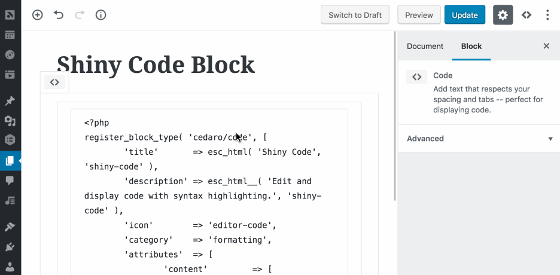

# Shiny Code

A Gutenberg block for editing and displaying code with syntax highlighting.

__Requires:__ PHP 7.0 (or later)  
__License:__ [GPLv2 (or later)](https://www.gnu.org/licenses/gpl-2.0.html)



## Features

* Choose a language for each code block
* Toggle whether or not line numbers should display
* Multiple syntax highlighting themes available
* Highlight specific lines to draw attention to them
* Choose a custom highlight color
* Easily transform to/from core Code blocks
* Code is saved as plain text, allowing it to be displayed in feeds and other contexts

### Languages

Support for the following languages is included by default:

* CSS
* HTML
* JavaScript
* JSON
* PHP

Additional languages can be registered using the `shiny_code_languages` filter.

### Themes

[Atom One Light](https://github.com/atom/one-light-syntax) and [Atom One Dark](https://github.com/atom/one-dark-syntax) themes are included and additional themes can be registered using the `shiny_code_themes` filter.

_CodeMirror and Prism.js don't tokenize code exactly the same, so there will likely be slight differences between the colors in the editor and on the frontend._

## Installation

To install _Shiny Code_:

1. [Download the latest release](https://github.com/cedaro/shiny-code/releases/latest) from GitHub (the saved file should be named `shiny-code-{version}.zip`).
2. Go to the _Plugins &rarr; Add New_ screen in your WordPress admin panel.
3. Click the __Upload__ button at the top next to the &ldquo;Add Plugins&rdquo; title.
4. Upload the zip file downloaded in the first step.
5. Click the __Activate Plugin__ link after installation completes.

### From Source

To build _Shiny Code_ from source, clone this repository in `wp-content/plugins/`, then run the build steps:

```shell
git clone https://github.com/cedaro/shiny-code.git
cd shiny-code
composer install
npm install
npm run build
```

After building the plugin, go to the _Plugins &rarr; Installed Plugins_ screen in your WordPress admin panel to activate _Shiny Code_.
