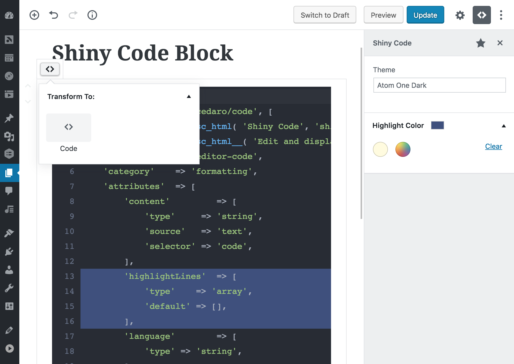

# Shiny Code

A Gutenberg block for editing and displaying code with syntax highlighting.



## Features

* Choose a language for each code block
* Toggle whether or not line numbers should display
* Multiple syntax highlighting themes available
* Highlight specific lines to draw attention to them
* Choose a custom highlight color
* Easily transform to/from core Code blocks
* Code is saved as plain text, allowing it to be displayed in feeds and other contexts

### Languages

Support for the following languages is included by default:

* CSS
* HTML
* JavaScript
* JSON
* PHP

Additional languages can be registered using the `cedaro_code_block_languages` filter.

### Themes

[Atom One Light](https://github.com/atom/one-light-syntax) and [Atom One Dark](https://github.com/atom/one-dark-syntax) themes are included and additional themes can be registered using the `cedaro_code_block_themes` filter.

_CodeMirror and Prism.js don't tokenize code exactly the same, so there will likely be slight differences between the colors in the editor and on the frontend._

## Installation

Shiny Code should be considered experimental while [Gutenberg](https://github.com/WordPress/gutenberg) is still in development. As such, it's currently only available from source:

```shell
git clone https://github.com/cedaro/shiny-code.git
composer install
npm install
npm run build
```
